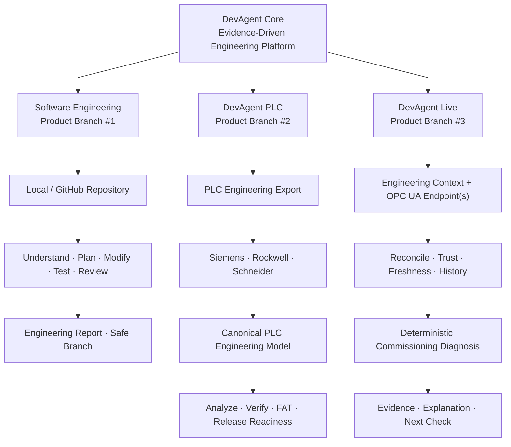
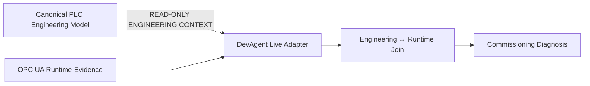

# DevAgent

[](LICENSE)
[](https://www.python.org/)
[](#project-status)
[](https://github.com/tomha85/devagent/actions/workflows/ci.yml)
[](https://github.com/sponsors/tomha85)

**A local, evidence-driven engineering agent for software engineering, offline PLC engineering/FAT review, and read-only onsite commissioning that turns source evidence and trusted runtime observations into bounded engineering decisions without treating model confidence as proof.**

> **From requirement to evidence-backed engineering decisions.**

> ❤️ **DevAgent is free during public beta.** If DevAgent saves you engineering time, consider [sponsoring continued development](https://github.com/sponsors/tomha85).

DevAgent runs against a developer's local repository or supported exported PLC engineering artifacts. For software work, it discovers the application, gathers source evidence, compiles explicit acceptance criteria, plans a bounded change, creates backups, implements the minimum necessary patch, runs repository-supported verification, independently reviews the final diff, and decides `VERIFIED`, `PARTIALLY_VERIFIED`, or `BLOCKED` from evidence rather than model confidence.

For PLC engineering, **DevAgent PLC** provides a vendor-dispatched offline/pre-site review workflow for **Siemens TIA Portal**, **Rockwell Studio 5000 / Logix Designer**, and **Schneider Electric EcoStruxure Control Expert / Unity Pro**. It normalizes supported exports into a canonical PLC model, analyzes logic and dependencies, verifies requirements where evidence permits, detects engineering risks, generates FAT procedures, evaluates regression impact, produces recommendations and evidence, and reports release readiness without pretending that static analysis replaces simulator, HIL, or real-PLC execution.

For onsite commissioning, **DevAgent Live** is a separate first-class **read-only product branch**. It owns its own onsite commissioning workflow, connects to OPC UA endpoints, reconciles engineering tags to runtime nodes, rejects bad/stale/replayed/ambiguous evidence, and supports deterministic blocker diagnosis, recursive tracing, stateful/historical context, numeric/analog comparisons, handshakes, AOI/FB context, fault codes, sequencers, motion/PID context, and bounded AI explanation. Live may consume stable canonical PLC engineering context through a read-only adapter contract, but it is not a sub-branch of DevAgent PLC and does not inherit FAT or release-readiness authority.

For a normal verified software run the deterministic harness prints the complete engineering report first, then commits reviewed paths and fast-forward pushes the developer's current non-protected branch. If the developer starts on `main`, `master`, or `trunk`, DevAgent creates a new safe branch instead. Runtime DevAgent never creates a pull request, merges, rebases, force-pushes, or deploys.

## General Architecture

DevAgent has **three sibling product branches** under one evidence-driven core. Each branch owns a distinct engineering responsibility, input model, safety boundary, and qualification path.



| Product branch | Primary input | Authority |
| --- | --- | --- |
| **Software Engineering** | Local / GitHub repository | Understand, modify, verify, review, report, publish a safe branch |
| **DevAgent PLC** | Exported PLC engineering artifacts | Offline engineering review, requirements, FAT, evidence, release readiness |
| **DevAgent Live** | Read-only engineering context + OPC UA runtime | Onsite commissioning diagnosis, runtime evidence, history, Q&A — **no PLC control** |

### Read-only PLC → Live integration contract

DevAgent Live is **not a child of DevAgent PLC**. PLC engineering context crosses into Live through a bounded data contract; PLC theorem/FAT ownership remains in DevAgent PLC, while OPC UA sessions, runtime trust/history, diagnosis, and commissioning Q&A remain owned by DevAgent Live.



**Solid lines** represent normal execution/data flow. The **dotted line** represents the read-only engineering-context contract; it does not transfer FAT, release-readiness, or PLC control authority to Live.

For the expanded branch boundaries, ownership model, internal flows, and evidence rules, see [General Architecture](docs/general-architecture.md).

## Why DevAgent?

Many coding agents optimize first for code generation. DevAgent is built around a different question:

**Can this change or engineering claim be supported by evidence on the exact analyzed revision/export?**

Core principles:

- **Evidence before modification** — insufficient source evidence blocks implementation.
- **Explicit acceptance contracts** — required criteria are `SATISFIED`, `UNPROVEN`, or `CONTRADICTED`; passing tests do not blanket-prove unrelated requirements.
- **False-`VERIFIED` resistance** — unsupported required criteria, missing final verification, known regressions, failed review, or source-state violations prevent a trustworthy success result.
- **Minimal-change discipline** — prefer the smallest correct diff over broad speculative refactors.
- **Backups before edits** — existing files are backed up before first modification.
- **Local-first isolation** — clean repositories use retained external detached worktrees by default; dirty developer work is protected.
- **Repository-native verification** — manifests, package scripts, test layouts, build files, and bounded CI evidence determine verification capabilities.
- **Independent review** — the final diff is reviewed separately from implementation.
- **Developer-grade reporting** — implementation logic, symbols, tests, acceptance evidence, verification, failures, gaps, and source-control status are recorded before publication.
- **Bring your own model** — OpenAI, Anthropic/Claude, xAI/Grok, Google Gemini, and OpenAI-compatible endpoints use one engineering workflow.
- **Deterministic branch publication** — only a `VERIFIED` isolated run can be committed and normally fast-forward pushed; `--no-publish` keeps the result local.
- **Read-only commissioning boundary** — DevAgent Live can diagnose trusted runtime state but cannot turn an AI answer into PLC control authority.

## Install

From PyPI:

```bash
python -m pip install devagent-ai
```

For DevAgent Live with OPC UA runtime support:

```bash
python -m pip install "devagent-ai[live]"
```

For an isolated CLI installation:

```bash
pipx install devagent-ai
```

For development from source:

```bash
git clone https://github.com/tomha85/devagent.git
cd devagent
python -m venv .venv
source .venv/bin/activate
python -m pip install -e ".[dev]"
pytest -q
```

The PyPI distribution is `devagent-ai`; the Python package and CLI command are both `devagent`.

## Configure a provider

OpenAI:

```bash
devagent setup --provider openai --model YOUR_MODEL
export OPENAI_API_KEY=...
devagent doctor
devagent doctor --live
```

Anthropic / Claude:

```bash
devagent setup --provider anthropic --model YOUR_MODEL
export ANTHROPIC_API_KEY=...
devagent doctor
```

xAI / Grok:

```bash
devagent setup --provider xai --model YOUR_MODEL
export XAI_API_KEY=...
devagent doctor
```

Google Gemini:

```bash
devagent setup --provider gemini --model gemini-3.7-flash
export GEMINI_API_KEY=...
devagent doctor
```

Gemini uses Google's documented OpenAI-compatible Gemini endpoint so DevAgent can reuse the same bounded provider interface and deterministic local schema validation. `--provider google` is an alias for the same integration.

OpenAI-compatible local or private endpoint:

```bash
devagent setup \
  --provider compatible \
  --model local-model \
  --base-url http://127.0.0.1:11434/v1
```

DevAgent stores the provider configuration and the **name** of the API-key environment variable. It does not store the API key itself.

### Model routing by engineering role

DevAgent can use one default model or route different models to stable roles:

```text
investigator → understand repository/problem
planner      → produce bounded implementation/verification plan
implementer  → implement, diagnose, repair/replan
reviewer     → independently review final diff
```

The deterministic harness remains responsible for safety, tool execution, verification validity, acceptance adjudication, final status, reporting, and source-control publication regardless of which model handles a role.

#### Example: use multiple AI models in one DevAgent run

You do not have to use one AI model for every reasoning step. If you believe different models are better suited to different engineering roles, configure a default model plus any role-specific overrides. Roles that are not explicitly configured fall back to the default model.

```bash
# Keep credentials in environment variables; DevAgent does not store the keys.
export OPENAI_API_KEY=...
export GEMINI_API_KEY=...
export ANTHROPIC_API_KEY=...
export XAI_API_KEY=...

# Default/fallback model.
devagent setup --provider openai --model YOUR_OPENAI_MODEL

# Optional per-role models.
devagent setup --role investigator --provider gemini --model YOUR_GEMINI_MODEL
devagent setup --role planner --provider anthropic --model YOUR_CLAUDE_MODEL
devagent setup --role implementer --provider openai --model YOUR_OPENAI_MODEL
devagent setup --role reviewer --provider xai --model YOUR_GROK_MODEL

# Inspect routing and optionally probe every configured cloud model.
devagent models
devagent doctor --live

# Run normally; saved role routing is applied automatically.
cd my-repo
devagent "Fix the checkout race condition and add regression coverage."
```

For example, a user may choose a fast or lower-cost model for repository investigation, a different model for planning, a preferred coding model for implementation, and another provider for independent review. This can be useful for cost, latency, provider diversity, or model-strength preferences, but it does not guarantee a better result. DevAgent still requires the same repository evidence, acceptance gates, deterministic verification, and publication rules.

When using saved role routing, run the task without run-level `--provider`, `--model`, or `--base-url` overrides. Supplying those flags explicitly selects one provider/model for that run instead of the saved per-role routing.

## Run

From the application repository:

```bash
devagent "Fix websocket reconnect bug and add regression tests"
```

For a normal `VERIFIED` result:

```text
DISCOVER / UNDERSTAND
        ↓
COMPILE ACCEPTANCE CONTRACT
        ↓
BASELINE / PLAN / GATHER CONTEXT
        ↓
IMPLEMENT MINIMAL PATCH
        ↓
TARGETED + BROAD VERIFICATION
        ↓
DIAGNOSE / REPLAN if needed
        ↓
INDEPENDENT REVIEW
        ↓
FINAL CURRENT-REVISION VERIFICATION
        ↓
FULL ENGINEERING REPORT
        ↓
VERIFIED ONLY: COMMIT + FAST-FORWARD PUSH BRANCH
        ↓
STOP — NO PR, NO MERGE
```

Repeated prompts on a normal local development branch continue that same branch when local/remote history is safely compatible. A protected starting branch (`main`, `master`, `trunk`) causes a new branch such as:

```text
devagent/20260825T020000Z-ab12cd
```

Explicitly start a new branch:

```bash
devagent \
  --publish-branch feature/devagent-csv-export \
  "Add CSV export to reports"
```

Run without commit/push:

```bash
devagent --no-publish "Add CSV export to reports"
```

Long requirements can be read from any bounded UTF-8 text file path; the filename extension is unrestricted:

```bash
devagent --input requirements/customer-feature.md
devagent --input ./task
devagent --input ../specs/release.requirement
```

Binary data, invalid UTF-8, secret-like paths, and files above the input-size bound are refused.

## PLC engineer quick start

DevAgent also provides an **offline PLC engineering review, requirement-verification, regression-analysis, risk-review, and FAT-planning workflow** through `devagent plc` for Siemens, Rockwell, and Schneider engineering exports.

The PLC workflow is intended for controls/PLC engineers who want to review exported engineering artifacts before FAT, site travel, commissioning, or release. DevAgent PLC does **not** connect to, upload to, download to, force, start, stop, or control a PLC, TIA Portal, Studio 5000, Control Expert, PLCSIM, Logix Echo, HIL bench, or production machine. Runtime FAT and commissioning execution remain owned by the PLC engineer; onsite read-only assistance belongs to the separate `devagent live` product branch.

### 1. Export the PLC project

**Rockwell Studio 5000 / Logix Designer:** export the full controller project as `.L5X`.

```text
Line1_Controller.L5X
```

**Siemens TIA Portal:** provide a TIA Openness/XML/generated-source file or export directory. Supported engineering inputs include `.scl`, `.db`, `.udt`, `.xml`, `.stl`, and `.awl`. Proprietary `.ap*` / `.zap*` project archives must be exported from TIA Portal first.

**Schneider Electric EcoStruxure Control Expert / Unity Pro:** export `.XEF` when possible. DevAgent also accepts supported granular Control Expert XML exchange files such as `.XSY`, `.XST`, `.XLD`, `.XBD`, `.XSF`, `.XIL`, `.XDD`, `.XDB`, `.XHW`, and `.XCM`. `.STU` and `.STA` work/archive formats are not direct static-analysis inputs; export the project to `.XEF`. A `.ZEF` may contain broader project exchange data, but use an extracted/supported engineering export for DevAgent analysis rather than assuming the archive itself is directly analyzable.

```text
Machine_Controller.XEF
```

#### Siemens `.zapXX` archived projects

Files such as `.zap17`, `.zap18`, `.zap19`, and `.zap20` are **TIA Portal archived projects**, not direct DevAgent static-analysis inputs. Do not point `devagent plc` directly at a `.zapXX` archive and assume the internal archive contents are equivalent to a supported engineering export.

Example:

```text
LearningFactory_4_0_24V_Task07_HighBayWarehouseHBW_V18.zap18
```

For this example, use **TIA Portal V18** to retrieve/open the `.zap18` archive, then export the engineering information that DevAgent can analyze. Prefer the matching TIA Portal version for the archive whenever practical.

Recommended flow:

```text
LearningFactory_4_0_24V_Task07_HighBayWarehouseHBW_V18.zap18
                         ↓
              TIA Portal V18 Retrieve/Open
                         ↓
                Restored TIA project
                         ↓
         Export engineering information
                         ↓
 OB / FB / FC / DB / UDT / SCL / LAD / FBD XML
                         ↓
                One export folder
                         ↓
            devagent plc ./HBW_V18_export/
```

For the strongest review, export as much related controller engineering evidence as available, including OB/FB/FC logic, DBs, UDT/data types, generated SCL/STL/AWL sources, LAD/FBD Openness XML, and relevant symbolic/tag information.

A typical export folder might look like:

```text
HBW_V18_export/
├── OB1.xml
├── Main.scl
├── FB_Conveyor.xml
├── FB_HighBayCrane.xml
├── FC_Positioning.xml
├── DB_HBW.xml
├── DB_IO.xml
├── MotorData.udt
└── Alarms.xml
```

Then run:

```bash
devagent plc ./HBW_V18_export/ \
  --ai \
  --output-dir ./HBW_review
```

Or include machine/customer requirements:

```bash
devagent plc ./HBW_V18_export/ \
  --requirements ./HBW_requirements.md \
  --ai \
  --output-dir ./HBW_review
```

**Do not rely on manually renaming or unzipping `.zapXX` archives as the production engineering workflow.** DevAgent's qualified Siemens path is based on exported TIA engineering artifacts and explicit support accounting, not undocumented assumptions about Siemens archive internals.

For Siemens, include the related OB/FB/FC logic, DB/UDT/type evidence, generated sources, and Openness XML used by the controller whenever available. A complete export gives DevAgent a stronger project-wide call/data/identity/support-boundary view than isolated snippets.

### 2. Add customer or machine requirements

`--requirements` is repeatable and accepts `.txt`, `.md`, `.csv`, `.json`, `.docx`, and `.pdf` when PDF support is installed.

Example:

```markdown
- Conveyor shall not run unless the main guard circuit is healthy.
- A safety fault shall prevent the motor run output.
- Reset shall not automatically restart the conveyor.
```

### 3. Run the engineering review

Rockwell:

```bash
devagent plc ./exports/Line1_Controller.L5X \
  --requirements ./requirements/line1.md \
  --ai \
  --output-dir ./plc-review/line1-current
```

Siemens:

```bash
devagent plc ./exports/TIA_Line1/ \
  --requirements ./requirements/line1.md \
  --ai \
  --output-dir ./plc-review/line1-current
```

Schneider:

```bash
devagent plc ./exports/Machine_Controller.XEF \
  --requirements ./requirements/line1.md \
  --ai \
  --output-dir ./plc-review/line1-current
```

`--ai` enables the evidence-constrained AI engineering-review layer. It is optional; the deterministic PLC analysis and FAT-planning path still runs without it.

### 4. Compare a PLC revision

Use `--baseline` with a previous export from the same vendor to identify changed logic, affected requirements, changed risks, and FAT tests that should be repeated.

```bash
devagent plc ./exports/new/TIA_Line1/ \
  --baseline ./exports/old/TIA_Line1/ \
  --requirements ./requirements/line1.md \
  --ai \
  --output-dir ./plc-review/line1-revision
```

The same pattern works for Rockwell using current and previous `.L5X` files and for Schneider using current and previous supported Control Expert exports such as `.XEF`.

### 5. Review the evidence package

A written run includes `fat_report.md` plus machine-readable evidence such as canonical IR, dependency graph, static verification, requirement verification, FAT tests/plans, risks, optimizations, regression impact, recommendations, evidence manifest, release readiness, and an exact run manifest.

The engineer should pay special attention to four kinds of results:

- **statically proven behavior** — supported semantics with the required identity, writer ownership, reachability, call binding, and source evidence;
- **`PARTIAL` / `OPAQUE` / `PROTECTED` support regions** — behavior that DevAgent intentionally refuses to overclaim from available exported source;
- **`FAT_REQUIRED` behavior** — timing, counting, hardware, external I/O/device, system-service, scheduling, unsupported-logic, or other runtime evidence that must be exercised by an engineer;
- **revision impact** — requirements, risks, logic areas, and FAT tests whose previous evidence may no longer be valid after a PLC change.

A passing static check does **not** replace FAT when the report requires runtime evidence.

Recommended workflow:

```text
EXPORT PLC PROJECT
        ↓
DEVAGENT PLC ENGINEERING REVIEW
        ↓
REQUIREMENT + LOGIC + RISK REVIEW
        ↓
GENERATED FAT PROCEDURES
        ↓
ENGINEER EXECUTES REQUIRED FAT EXTERNALLY
        ↓
CAPTURE / IMPORT TRUSTED EVIDENCE WHEN APPLICABLE
        ↓
ENGINEERING APPROVAL
        ↓
SITE COMMISSIONING / RELEASE PROCESS
```

For signed runtime-result, policy, trust-store, and approval workflows, and a complete explanation of Rockwell/Siemens/Schneider evidence boundaries, see **[PLC Engineer Guide](docs/plc-engineer-guide.md)**.

## DevAgent Live onsite commissioning quick start

Use **DevAgent Live** as the separate onsite product branch when the engineer needs to understand the running controller/system, inspect trusted runtime state, diagnose a blocked condition, trace modeled logic upstream, inspect recent trusted transitions, or identify the next evidence-backed check.

DevAgent Live is intentionally separate from DevAgent PLC:

```text
DevAgent PLC  = Product Branch #2 — offline engineering / FAT authority
DevAgent Live = Product Branch #3 — onsite read-only commissioning
```

For the strongest commissioning diagnosis, provide both the supported PLC engineering export/context and the OPC UA endpoint:

```text
Read-only engineering context
            +
      OPC UA endpoint
            ↓
       DevAgent Live
            ↓
commissioning diagnosis
```

Install Live runtime support:

```bash
python -m pip install "devagent-ai[live]"
```

Start the interactive commissioning assistant with bounded history:

```bash
devagent live assist /path/to/project-export \
  --endpoint opc.tcp://10.0.0.20:4840/ \
  --history-seconds 900 \
  --history-poll-seconds 1 \
  --history-max-tags 128
```

Example onsite questions:

```text
Why is Conveyor7_Run not active?
Which permissive is blocking it?
Why is that permissive false?
Why is SequenceState not advancing?
Why is Timer1 not done?
Why did Conveyor7_Run stop 30 seconds ago?
What is the current fault code?
Is Speed above the configured limit?
What should I check next?
```

The Live diagnosis stack can use supported canonical engineering evidence for Boolean logic, recursive dependencies, timers/counters/state machines, numeric/analog comparisons, one-shot/latch context, handshakes, AOI/FB context, fault-code observations, sequencers, motion/PID context, and UDT/array structure context. Coverage is evidence-bounded: unsupported, partial, source-protected, ambiguous, stateful-history-dependent, or untrusted regions remain `INDETERMINATE`/limited instead of being guessed.

Runtime evidence is also fail-closed. BAD, stale, replayed, uncertain, missing, or ambiguously reconciled OPC UA values are not accepted as definitive current-state proof.

The Live control boundary is strict:

```text
READ ONLY
no write
no force
no reset
no bypass
no download
no mode change
no start / stop control
```

Useful Live commands include:

```bash
devagent live --help
devagent live doctor --help
devagent live probe --help
devagent live browse --help
devagent live read --help
devagent live snapshot --help
devagent live watch --help
devagent live plan --help
devagent live commission --help
devagent live assist --help
devagent live qualify --help
devagent live vendor-qualify --help
devagent live soak --help
devagent live readiness --help
devagent live commercial-readiness --help
```

Commercial V1 field qualification remains evidence-driven. Real runtime/vendor endpoints and the required soak/doctor artifacts must pass; simulator or missing runtime evidence cannot be converted into a production PASS. See **[DevAgent Live Commercial V1 Qualification Runbook](docs/live/commercial-v1-runbook.md)**.

## Practical examples

DevAgent is intended for real repository work, not only one-line code generation. Run it from the repository you want to change and describe the engineering outcome you need.

### 1. Fix a bug and prove the regression is covered

```bash
cd my-service
devagent "Fix the websocket reconnect bug that duplicates subscriptions after a network drop. Add a regression test and keep the public API unchanged."
```

**Benefit:** DevAgent first discovers the relevant implementation and tests, turns the request into explicit acceptance criteria, makes a bounded patch, runs repository-supported verification, independently reviews the final diff, and only reports `VERIFIED` when the required evidence supports it.

### 2. Add a feature on a dedicated branch

```bash
cd my-app
devagent \
  --publish-branch feature/csv-export \
  "Add CSV export for filtered reports. Preserve the existing JSON export behavior and add tests."
```

**Benefit:** a verified change can be committed and pushed to the requested feature branch while DevAgent stops before PR creation or merge, leaving integration control with the developer or repository owner.

### 3. Give DevAgent a longer product or customer requirement

```bash
cd my-repo
devagent --input requirements/customer-billing-retry.md
```

The input can be any bounded UTF-8 text file; it does not need a special extension or DevAgent-specific format.

**Benefit:** long requirements stay in a reviewable file instead of being compressed into a short prompt, while DevAgent still derives bounded implementation and verification work from repository evidence.

### 4. Perform a refactor that includes rename/move/delete operations

```bash
cd my-repo
devagent "Rename LegacyOrderService to OrderService, move it into the services package, update all references, remove the obsolete module, and preserve behavior."
```

**Benefit:** structural changes go through backup-first workspace operations, path/scope checks, repository verification, and final-diff review instead of uncontrolled file manipulation.

### 5. Change a database schema with forward/rollback verification

```bash
cd my-python-service
devagent "Add a nullable status column to the SQLite orders table, provide a forward and rollback migration, update the data-access layer, and verify both migration directions."
```

**Benefit:** migration work can be treated as high-risk engineering work with explicit acceptance evidence instead of assuming that a generated migration is correct because it looks plausible. The current qualified production fixture covers SQLite forward/rollback migration behavior; broader PostgreSQL/MySQL coverage remains an external-validation area.

### 6. Work in Java or .NET repositories

```bash
cd my-java-service
devagent "Add validation for duplicate customer IDs in this Maven service and add the appropriate JUnit regression test."
```

```bash
cd my-dotnet-service
devagent "Fix the null-handling bug in the order import path and verify the .NET project still builds successfully."
```

**Benefit:** DevAgent discovers repository-native Maven/Gradle and .NET project evidence instead of forcing every repository through a Python-centric workflow.

### 7. Keep all changes local for inspection

```bash
cd my-repo
devagent --no-publish "Refactor retry handling to remove duplicate logic and keep behavior unchanged."
```

**Benefit:** you still get implementation, verification, independent review, and the engineering report, but DevAgent does not commit or push the result.

### 8. Use the model/provider you prefer

```bash
# Configure once
devagent setup --provider anthropic --model YOUR_MODEL
export ANTHROPIC_API_KEY=...

# Then use the same DevAgent engineering workflow
devagent "Fix the failing checkout integration test without weakening the assertion."
```

You can similarly configure OpenAI, Gemini, Grok/xAI, or an OpenAI-compatible endpoint.

**Benefit:** the model supplies reasoning, while DevAgent keeps the same deterministic acceptance, safety, verification, reporting, and publication rules around it.

## What DevAgent adds around an AI coding model

| Common engineering risk | DevAgent behavior |
| --- | --- |
| The model says “done” without enough proof | Required acceptance criteria remain `UNPROVEN` or the run becomes `PARTIALLY_VERIFIED` / `BLOCKED` instead of falsely claiming success. |
| A patch touches unrelated code | Evidence gathering, explicit scope, minimal-change planning, and independent diff review constrain the change. |
| Existing developer work is damaged | Clean repositories use isolated worktrees by default; dirty tracked/untracked developer work is protected; files are backed up before first modification. |
| Tests passed before a later edit | Verification is revision-aware, so older successful evidence does not prove a newer tree. |
| A generated change breaks the build or tests | DevAgent runs repository-supported targeted/broad checks and can diagnose/replan before final verification. |
| An agent pushes directly to a protected primary branch | Starting from `main`, `master`, or `trunk` causes DevAgent to work on a safe branch; runtime DevAgent does not merge or deploy. |
| You are locked to one model vendor | OpenAI, Claude, Gemini, Grok/xAI, and compatible endpoints can use the same engineering harness. |
| It is hard to audit what the agent actually did | DevAgent emits an engineering report with decisions, changed symbols, tests, acceptance evidence, verification, failures, gaps, and source-control status. |

The goal is not to replace developer judgment. The goal is to make autonomous engineering work **bounded, reviewable, reproducible, and harder to falsely declare complete**.

Useful commands:

```bash
devagent --help
devagent --version
devagent setup --help
devagent doctor
devagent models
devagent status
devagent plc --help
devagent live --help
devagent benchmark --help
```

### Pinned real-world benchmark

DevAgent includes an opt-in benchmark runner for pinned GitHub repositories. A benchmark case injects a deterministic defect into an exact commit and uses an **external oracle** before and after DevAgent. This avoids treating DevAgent's own report as the benchmark oracle.

```bash
devagent benchmark \
  --catalog /path/to/realworld-cases.json \
  --report .devagent/realworld-benchmark.json
```

A `VERIFIED` result with a failing external oracle is explicitly counted as a **false VERIFIED**. See [docs/realworld-benchmark.md](docs/realworld-benchmark.md) for the catalog contract and safety boundary.

## Outcome contract

### `VERIFIED`

Used only when required acceptance criteria are satisfied by admissible evidence, applicable final verification passes on the current revision, no known new regression remains, scope is acceptable, and independent review approves the final diff.

Only `VERIFIED` is eligible for automatic commit/push.

### `PARTIALLY_VERIFIED`

Used when meaningful implementation evidence exists but complete proof cannot be obtained, for example because of unavailable hardware, VPNs, credentials, external services, or environment limitations.

It is never auto-published.

### `BLOCKED`

Used when DevAgent cannot safely understand, implement, or verify the request. It is never auto-published.

A truthful conservative result is preferable to a false `VERIFIED`.

## Safety boundary

DevAgent uses defense-in-depth controls around repository modification, command execution, publishing, and industrial runtime evidence:

- external isolated worktrees for clean repositories by default;
- dirty tracked and real untracked developer files are protected;
- backups before first file modification;
- workspace confinement and symlink-escape checks;
- secret-like path exclusions;
- engineering commands executed as argv without a general shell;
- credential environment scrubbing for verification where appropriate;
- model-facing command policy blocks Git write operations;
- publication is a separate deterministic post-report step and disables repository-controlled Git hooks for commit/push;
- only reviewed changed paths are staged;
- remote branch state is captured and rechecked to block publication races;
- protected targets are refused and force push is never used;
- no runtime PR, merge, rebase, force-push, or deployment automation;
- DevAgent Live exposes no PLC write/force/reset/bypass/download/mode-change/start-stop control surface;
- DevAgent Live uses trusted-current/freshness/reconciliation gates before runtime values can support definitive commissioning conclusions.

On Linux, DevAgent can execute engineering commands inside a bubblewrap-based operating-system sandbox. Production qualification exercises required sandbox mode with network access denied. Required mode fails closed when isolation cannot be established rather than silently falling back. Review the report and pushed branch before integrating customer or production code: sandboxing reduces execution risk, but it does not make arbitrary generated changes universally safe.

## Repository intelligence and verification

Discovery understands common evidence from:

- Python: `pyproject.toml`, requirements, pytest/unittest conventions;
- JavaScript/TypeScript: `package.json`, scripts, TypeScript configuration, React/Vite/Next-style repositories;
- Go: `go.mod`;
- Rust: `Cargo.toml`;
- Java: Maven/Gradle;
- C/C++: CMake/Make/Meson;
- .NET: solution/project files;
- CI: GitHub Actions, Jenkins, GitLab CI, Azure Pipelines;
- multi-component repositories and repository documentation.

Verification can include baseline tests, targeted tests, component/broad checks, integration/e2e commands, builds, lint/type checks, and `git diff --check`. Every verification result records phase and revision so an edit invalidates success from an older tree.

## Production qualification

DevAgent 0.8.0 uses cumulative production qualification rather than replacing older evidence with a smaller new suite.

- **v4 — 70 required cases** covering end-to-end engineering behavior, acceptance truthfulness, task/risk scope, provider contracts and parity, model routing, worktree and Git publication safety, CLI input, review/repair loops, report/evaluation integrity, release integrity, large-repository behavior, structural refactors, Java/.NET discovery and execution, SQLite migration forward/rollback, and real repository-native stacks.
- **v5 — 9 required autonomy cases** covering bounded parallel coordination, dirty-source refusal, real isolated parallel DevAgent runs, bounded/relevant skills and provider injection, automation overlap claim/recovery, and provider-benchmark deduplication, live structured-contract behavior, and secret redaction.

The v0.8 merge commit on `main` passed both catalogs in required Linux sandbox mode:

```text
v4: 70/70 passed
v5:  9/9 passed
combined: 79/79 passed
```

The qualification environment exercises real local toolchains for:

```text
Python / pytest
Node + TypeScript repository discovery
Go
Rust / Cargo
C++ / Make
Java / Maven
.NET build
SQLite migration forward + rollback
```

Run the same release qualification catalogs locally on a machine with the required toolchains:

```bash
DEVAGENT_SANDBOX=required DEVAGENT_NETWORK=deny \
python -m devagent.qualification \
  --catalog evaluation/benchmark_v4.json \
  --report .devagent/production-qualification-v4.json

DEVAGENT_SANDBOX=required DEVAGENT_NETWORK=deny \
python -m devagent.qualification \
  --catalog evaluation/benchmark_v5.json \
  --report .devagent/production-qualification-v5.json
```

Production CI also runs Python 3.10/3.11/3.12, a clean wheel build/install, real bubblewrap sandbox smoke, and both qualification catalogs. Qualification JSON is retained as CI evidence.

**100% qualified means 100% of these explicit catalogs passed on that revision and environment.** It does not mean mathematical correctness for every unseen repository, environment, model response, language, provider, or engineering task, and it is not a claim that DevAgent is universally superior to every hosted coding platform.

See [docs/production-readiness.md](docs/production-readiness.md) for the project's earlier readiness assessment and its explicit limitations.

### DevAgent Live commercial qualification

DevAgent Live has a separate field-readiness contract because onsite OPC UA behavior cannot be proven by software/static fixtures alone. Commercial V1 requires five evidence gates:

```text
CV1-001  Real OPC UA LQ-001..LQ-014 = 14 PASS / 0 FAIL / 0 BLOCKED
CV1-002  Real Rockwell + Siemens + Schneider endpoint qualification
CV1-003  Deterministic stateful / sequence diagnosis contract
CV1-004  Trusted historical commissioning timeline contract
CV1-005  Production doctor PASS + real read-only soak >= 8 hours
```

Missing real runtime evidence remains `BLOCKED`; an inconsistent or below-contract artifact is `FAIL`. A simulator is useful for development/runtime validation but does not certify a real vendor endpoint. See [docs/live/commercial-v1-runbook.md](docs/live/commercial-v1-runbook.md).

## Provider architecture

Currently supported:

| Provider | Configuration |
| --- | --- |
| OpenAI | `--provider openai` |
| Anthropic / Claude | `--provider anthropic` or `--provider claude` |
| xAI / Grok | `--provider xai` or `--provider grok` |
| Google Gemini | `--provider gemini` or `--provider google` |
| Local / OpenAI-compatible | `--provider compatible --base-url ...` |

Provider choice affects reasoning quality, cost, latency, and privacy characteristics. It does not change DevAgent's deterministic acceptance, safety, verification, reporting, and publication rules. `devagent models` labels deterministic adapter status as `CONTRACT-QUALIFIED` or `SUPPORTED`; `devagent doctor --live` is the explicit real API/model structured-output readiness probe and consumes provider usage.

## Engineering report

The report is emitted **before** source-control publication and includes:

- implementation logic summary first;
- requirement, task type, and risk;
- root cause or design gap;
- implementation decisions;
- deterministically extractable changed symbols and test cases;
- acceptance criteria with status, evidence, and reasons;
- verification matrix with command, phase, revision, exit code, duration, and test counts;
- failed-check output and failure classification;
- independent-review result;
- completeness and known gaps;
- recommendations;
- source-control plan/status and developer review checklist.

After a successful verified publication, a separate receipt records remote, branch, exact commit SHA, committed/pushed status, and confirms no PR or merge was performed.

## Local run data

Run artifacts are stored under the target repository's `.devagent/` state, including metadata, per-run backups, observations, verification records, `report.json`, retained worktrees, and evidence-backed repository/strategy memory.

Repository facts carry source fingerprints so stale evidence can be invalidated when source files change.

## Development

```bash
python -m compileall -q devagent
pytest -q
git diff --check
python -m devagent.qualification
```

Automated provider tests normally use deterministic or mocked clients and do not consume cloud-model credits. Source-control tests use disposable local Git repositories. Production qualification deliberately executes its real local toolchain fixtures.

## Project status

DevAgent 0.8.6 is **beta software with a verified core release baseline**. The exact v0.8 merge revision on `main` passed Production CI across Python 3.10/3.11/3.12, clean wheel installation, real Linux bubblewrap sandbox execution, production qualification v4 (**70/70**), and autonomy qualification v5 (**9/9**), for **79/79 cumulative required qualification cases**.

The current core includes evidence-backed `VERIFIED` / `PARTIALLY_VERIFIED` / `BLOCKED` outcomes, backup-first editing, isolated worktrees, bounded structural file operations, repository-native verification, independent review, safe branch publication, provider/model choice, Java and .NET engineering discovery/execution, SQLite migration forward/rollback verification, large-monorepo deep-manifest discovery, bounded parallel agents, repository-local skills, foreground automations, Linux OS sandboxing, bounded browser/local-UI verification, and real-provider structured-contract benchmarking.

Current `main` also includes vendor-dispatched **DevAgent PLC** engineering review for **Rockwell Studio 5000 full-project `.L5X`**, **Siemens TIA Portal exported engineering artifacts**, and **Schneider Electric EcoStruxure Control Expert / Unity Pro XML engineering exports with `.XEF` preferred**. All three feed the canonical PLC engineering/review/FAT/report pipeline while preserving vendor-specific proof boundaries. Siemens qualification is cumulative through its V9 support-accounting stack. Schneider includes V9 support closeout plus additive V10 real-ST local-action modeling and the PLC Report Contract V1, while unsupported or stateful/runtime-dependent regions remain explicitly `PARTIAL`, `OPAQUE`, `PROTECTED`, or FAT-gated. Rockwell remains the mature Studio 5000 path. These are bounded static engineering capabilities; they do not claim simulator, HIL, field wiring, process physics, or real-controller execution unless corresponding runtime evidence is supplied.

Current `main` also includes the independent **DevAgent Live** onsite product branch. Live consumes canonical PLC engineering context through a read-only adapter contract without modifying DevAgent PLC authority, reconciles engineering tags to OPC UA runtime nodes, applies trust/freshness/replay gates, and supports direct/recursive blocker diagnosis, stateful and historical context, numeric/analog comparisons, one-shot/latch awareness, handshake diagnosis, AOI/FB context, fault-code observations, generic sequencer context, motion/PID context, and UDT/array structure context. Unsupported or insufficiently evidenced behavior remains bounded/indeterminate. Live's Commercial V1 field-readiness gate still requires real OPC UA 14/14, real three-vendor endpoint evidence, production doctor evidence, and a qualifying read-only soak; merged feature coverage is not itself a claim of completed field certification.

These results are **bounded engineering claims**, not universal-correctness or market-superiority claims. They are tied to explicit qualification cases, pinned revisions, deterministic fixtures/external oracles where applicable, and the environments actually exercised by CI or documented local qualification.

Remaining work is primarily **breadth and external validation**, not missing core architecture: a larger public corpus of pinned upstream repositories and tasks; broader browser/UI coverage across dynamic applications and multiple browser environments; a wider Java/Gradle, .NET test-framework, and PostgreSQL/MySQL migration matrix beyond the current qualified fixtures; larger and more diverse monorepo stress cases beyond the current >12,000-file deep-manifest case; more real-world multi-agent workload studies; continuous paid real-provider benchmarking across a broader set of model/provider combinations; additional real license-safe Siemens/Rockwell/Schneider PLC export qualification beyond deterministic repository fixtures and official/demo interoperability samples; and real DevAgent Live commissioning qualification across representative vendor-supported OPC UA endpoints and longer site-like soak runs. GitHub branch protection/rulesets are external repository settings and must be configured separately; DevAgent does not claim to configure them itself.

The project intentionally prioritizes trustworthy outcomes, reproducible evidence, and safe engineering behavior over feature count or unsupported "best agent" claims.

## ❤️ Support DevAgent

DevAgent is currently free to use during public beta.

If DevAgent saves you engineering time or helps you deliver safer, better-verified software or PLC engineering work, you can support continued development through [GitHub Sponsors](https://github.com/sponsors/tomha85).

Your sponsorship helps fund:

- new engineering and PLC capabilities;
- Siemens, Rockwell, and Schneider verification;
- DevAgent Live onsite commissioning qualification;
- additional AI provider support;
- regression and production qualification;
- documentation and examples;
- continued free public releases.

[](https://github.com/sponsors/tomha85)

## Contributing

Contributions are welcome. Read [CONTRIBUTING.md](CONTRIBUTING.md) before opening a pull request. Changes to safety, verification, reporting, acceptance semantics, providers, bounded publication behavior, PLC engineering proof boundaries, or DevAgent Live trust/read-only behavior should include regression evidence and must not give model-generated actions unrestricted Git or PLC control authority.

## Security

Please do not publish sensitive vulnerability details in a public issue. See [SECURITY.md](SECURITY.md) for the reporting process and security scope.

## License and attribution

DevAgent is open source under the [MIT License](LICENSE).

```text
Copyright (c) 2026 Tom Ha
```

DevAgent was created by **Tom Ha**. Original repository: **https://github.com/tomha85/devagent**. See [NOTICE](NOTICE) and [COPYRIGHT](COPYRIGHT) for project attribution.