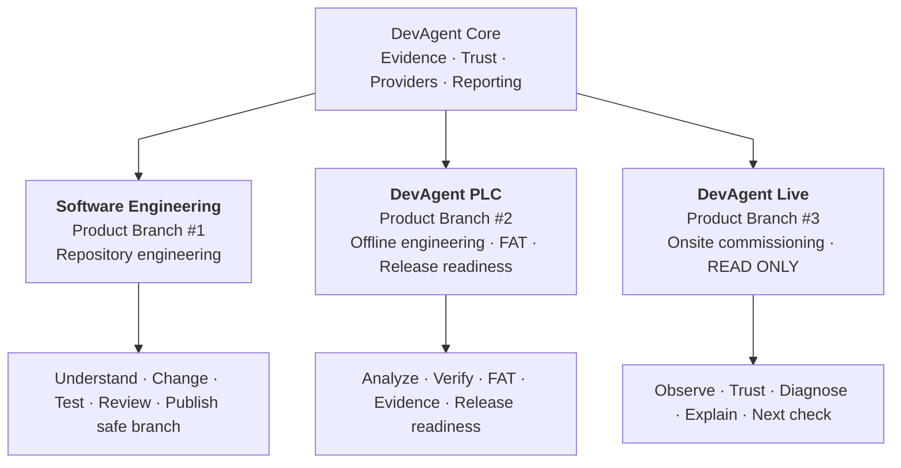
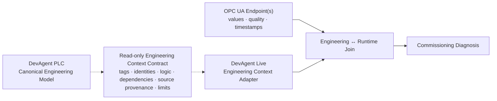
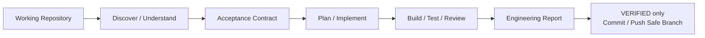
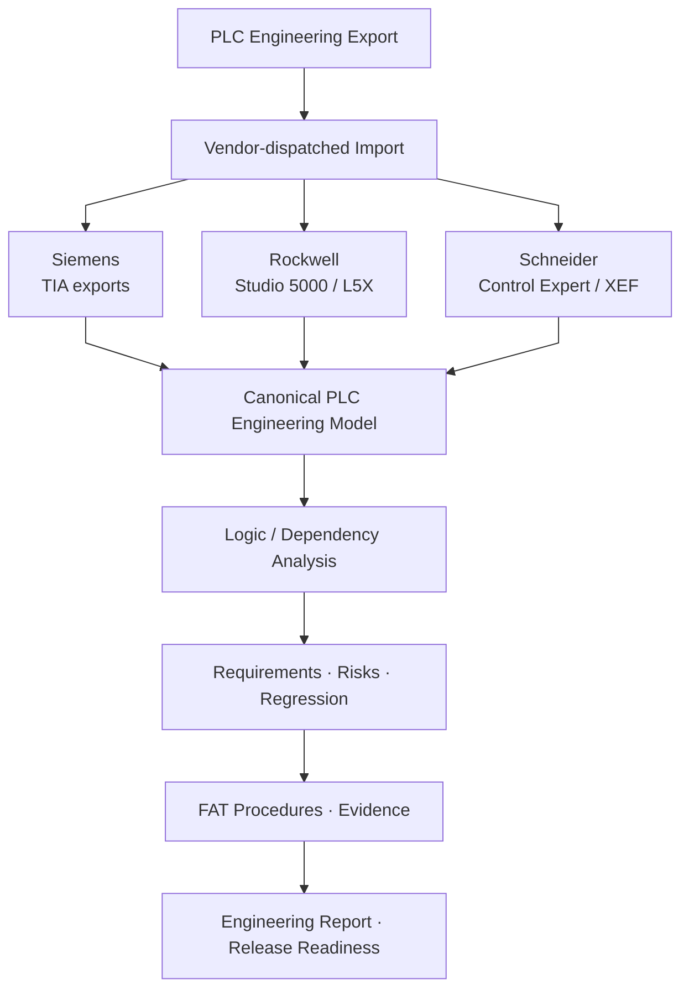
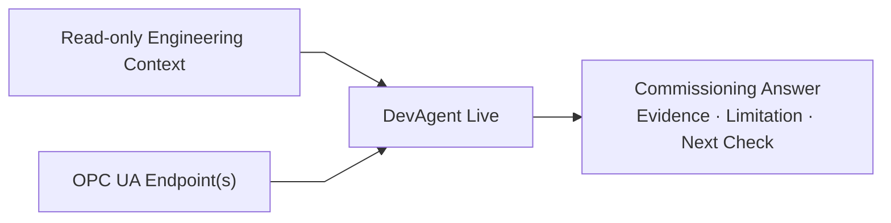
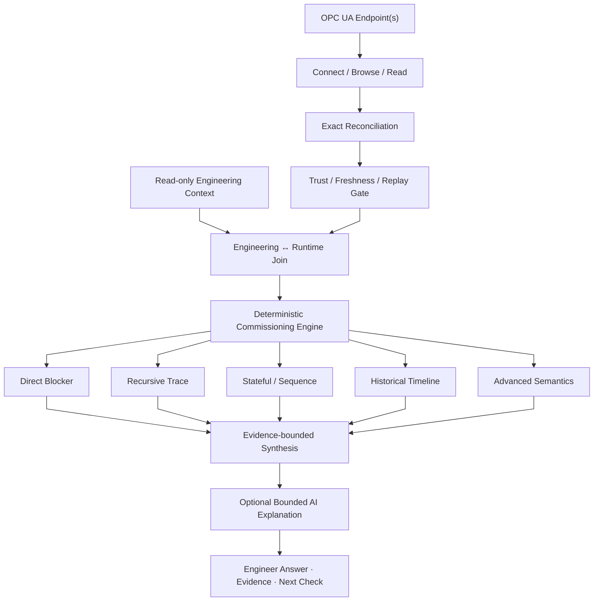
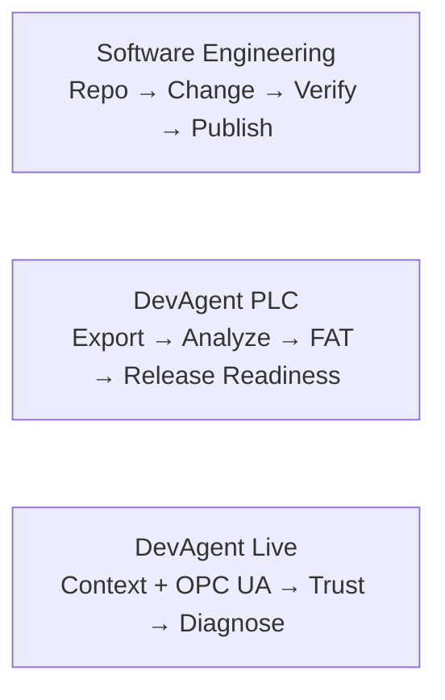

# DevAgent — General Architecture

DevAgent has one evidence-driven core with **three independent product branches**. They share evidence, provider, trust, reporting, and fail-closed principles, but each branch owns a different engineering workflow, authority boundary, and qualification path.

## Product architecture

The top-level product model is intentionally simple: three sibling branches directly under DevAgent Core.



### Ownership at a glance

| Product branch | Primary input | Owns | Does not own |
| --- | --- | --- | --- |
| **Software Engineering** | Local/GitHub repository | Code understanding, bounded modification, verification, review, safe branch publication | PLC engineering or onsite runtime control |
| **DevAgent PLC** | Exported PLC engineering project | Static engineering analysis, requirements, risks, regression, FAT, evidence, release readiness | OPC UA session management or onsite commissioning control |
| **DevAgent Live** | Read-only engineering context + OPC UA runtime evidence | Runtime trust, history, commissioning diagnosis, onsite Q&A | FAT authority, PLC write/force/reset/download/mode control |

## Read-only integration contract

DevAgent PLC and DevAgent Live are **not parent and child products**. Their integration is a bounded data contract.

The dotted line below is intentionally horizontal and straight: it represents **read-only data reuse**, not execution or control ownership.



**Legend**

- **Solid line** = branch-owned execution/data flow.
- **Dotted line** = read-only engineering-context contract.
- The dotted contract never grants Live FAT/release authority and never grants PLC runtime-control responsibility.

The authority boundary remains:

```text
DEVAGENT PLC  = offline engineering / FAT / release-readiness authority
DEVAGENT LIVE = onsite read-only commissioning authority
```

DevAgent Live must not modify Siemens, Rockwell, Schneider, FAT, regression, theorem, or release-readiness behavior merely to implement an onsite feature. Once engineering information crosses the read-only adapter boundary, commissioning behavior is owned by `devagent/live/**`.

## Product Branch #1 — Software Engineering

DevAgent works directly with a software repository. It can understand the repository, implement a bounded code change, run repository-native tests/builds, independently review the result, produce an engineering report, and publish a verified commit to a safe branch.



If a software run starts on `main`, `master`, or `trunk`, DevAgent creates a safe working branch. Runtime DevAgent does not create or merge pull requests, rebase, force-push, or deploy.

## Product Branch #2 — DevAgent PLC

DevAgent PLC works from exported PLC engineering artifacts rather than editing or controlling the live PLC. Siemens, Rockwell, and Schneider each have a vendor-specific import path, but all feed the same canonical engineering/review pipeline.

Primary responsibilities include:

- AI Engineering Review;
- Requirement Verification;
- Test Generation and FAT planning;
- Risk Detection;
- Optimization recommendations;
- Regression Analysis;
- Evidence and provenance;
- FAT Report;
- Release Readiness.

### DevAgent PLC flow



DevAgent PLC is a **pre-site/offline engineering workflow**. It does not claim simulator, HIL, field wiring, process physics, or real-controller execution unless corresponding runtime evidence is supplied.

## Product Branch #3 — DevAgent Live

DevAgent Live is an independent onsite product branch for commissioning engineers. Its purpose is not to regenerate the offline FAT/report workflow. Its job is to help an engineer understand the running system, inspect trusted live state, diagnose why a machine condition is blocked or abnormal, trace modeled dependencies, inspect bounded history, and identify the next evidence-backed check.

### Inputs owned by Live



The engineering context can originate from the same supported PLC export used by DevAgent PLC, but Live consumes it through its own adapter boundary. This avoids duplicating Siemens/Rockwell/Schneider parser logic without collapsing the two products into one hierarchy.

Why both inputs matter:

- engineering context provides logic, tags, dependencies, source provenance, interlocks/permissives, states, calls, and modeled semantics;
- OPC UA provides live values, quality, timestamps, namespace identity, and runtime observations;
- endpoint-only operation can observe exposed state, but usually cannot prove hidden PLC source logic or why an output is commanded.

### DevAgent Live internal architecture



Advanced semantics currently include evidence-bounded support for numeric/analog comparisons, one-shot/latch context, handshakes, AOI/FB context, fault-code observations, sequencers, motion/PID context, and UDT/array structure context.

### Live evidence rules

Live remains fail-closed:

- only trusted `CURRENT` runtime evidence may support definitive current-state conclusions;
- BAD, stale, replayed, uncertain, missing, or ambiguous evidence cannot be silently promoted;
- multiple writers, partial/opaque logic, stateful history gaps, unsupported semantics, and ambiguous target identity remain limitations rather than guessed root causes;
- historical ordering may identify temporal candidates, but “changed before” does not automatically mean “caused”;
- AI may explain bounded evidence, but it cannot upgrade evidence class or invent hidden PLC logic.

### Read-only control boundary

DevAgent Live has no PLC write/control authority. The product boundary excludes:

```text
write / force / reset / bypass / download / mode change /
start / stop / PLC control method calls
```

Natural-language requests for those actions are refused before diagnosis/AI execution.

## CLI map

| Command | Product branch | Purpose |
| --- | --- | --- |
| `devagent ...` | Software Engineering | Repository engineering workflow |
| `devagent plc ...` | DevAgent PLC | Offline PLC engineering / FAT authority |
| `devagent live ...` | DevAgent Live | Read-only onsite commissioning |

Typical Live start:

```bash
python -m pip install "devagent-ai[live]"

devagent live assist /path/to/project-export \
  --endpoint opc.tcp://10.0.0.20:4840/ \
  --history-seconds 900
```

Example onsite questions:

```text
Why is Conveyor7_Run not active?
Which permissive is blocking it?
Why is that permissive false?
Why is SequenceState not advancing?
Why is Timer1 not done?
Why did Conveyor7_Run stop 30 seconds ago?
What is the current fault code?
Is Speed above the configured limit?
What should I check next?
```

Commercial qualification commands are documented in [`docs/live/commercial-v1-runbook.md`](live/commercial-v1-runbook.md).

## Architecture summary



The three product branches are siblings under DevAgent Core. They may share stable contracts and evidence primitives, but their execution paths, authority, safety boundaries, and qualification responsibilities intentionally remain separate.
